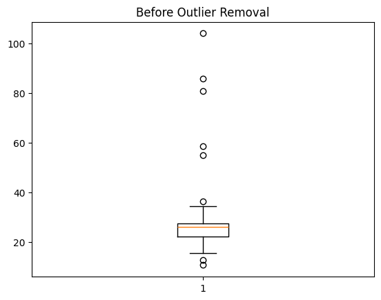
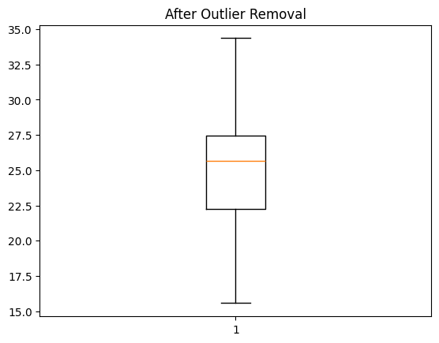

# 📊 Data Cleanser Project

## Data Preprocessing & Feature Engineering


---

## 📌 Project Overview

This project focuses on **data preprocessing and cleaning** using a healthcare dataset.
The main goal is to handle **missing values and outliers** to prepare a clean dataset for machine learning tasks such as disease risk prediction.

---

## 🎯 Objective

* Handle missing values using different imputation techniques
* Detect and treat outliers using statistical methods
* Prepare a clean and reliable dataset
* Improve data quality for machine learning models

---

## 📂 Dataset Description


The dataset contains patient health records with the following features:

* **patient_id** – Unique ID
* **age** – Age of patient
* **gender** – Male/Female
* **region** – North/South/East/West
* **bmi** – Body Mass Index
* **blood_pressure** – Blood pressure level
* **cholesterol** – Cholesterol level
* **glucose** – Glucose level
* **disease_risk** – Target (0 = Low, 1 = High)

---

## ⚙️ Technologies Used


* Python 🐍
* Pandas
* NumPy
* Matplotlib
* Scikit-learn

---

## 🔍 Data Preprocessing Steps

### 1. Missing Value Handling

* Mean imputation (Numerical features)
* Mode imputation (Categorical features)
* KNN Imputer
* MICE Algorithm

---

### 2. Outlier Detection & Treatment



* Z-score method
* IQR method
* Percentile method
* Winsorization

---

## 📊 Results


* Missing values successfully handled
* Outliers removed or capped
* Dataset cleaned and ready for ML
* Improved data consistency and accuracy

---

## 📁 Project Structure

```
📦 Data-Cleanser-Project
 ┣ 📄 health_data.csv
 ┣ 📄 cleaned_health_data.csv
 ┣ 📄 notebook.ipynb
 ┣ 📄 README.md
```

---

## 🚀 How to Run

1. Install required libraries:

```bash
pip install pandas numpy matplotlib scikit-learn
```

2. Run Jupyter Notebook:

```bash
jupyter notebook
```

3. Open and execute `notebook.ipynb`

---

## 📝 Conclusion

Data cleaning is an important step in data science.
By handling missing values and outliers, we improved data quality and made the dataset suitable for machine learning.

---

## 👩‍💻 Author

**Disha Lukhi**
AI | ML | Data Science Student 🚀

---

## ⭐ Acknowledgment

This project was created as part of a data science learning assignment.
